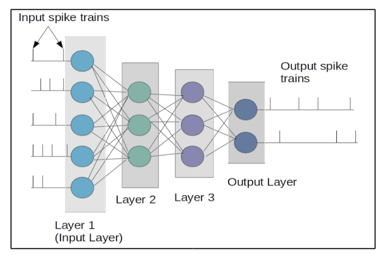

.. _Users-Topology:

Topology
========

In terms of the topology, we are looking into an architecture of the network and interconnections among neurons. The architecture of the simulated neuronal network can be divided as layered and non layered. Layered networks that can be implemented with this platform is a feedforward network. No recurrency is possible at the moment for a layered network. Different neuron models can be implemented for each layer, for eg. input layer can be of Leaky Integrate and Fire neuons and layer 2 can be Izhikevich and so on.

Within layered and non-layered networks, how the neurons are connected can also be altered. Manual connection is not a suitable choice since it is labourous and takes very long time to configure one by one. Hence, three differnt options for automatic interconnections are presented. Please see :ref:`interconnections_lable` for more details about the options.

Architecture
------------

Layered
~~~~~~~

The figure below shows a typical graphical representation of what a layered network is. This is the exact same kind of network that is created under layered network option.
The first step of the network creation is specifying whether to create a layered or non layered network. 

  Figure:  Graphical illustration of the layered network

Non-layered
~~~~~~~~~~~

.. figure:: ../images/topology_nonlayered.png

  Figure:  Graphical illustration of the non-layered network 

.. _interconnections_lable:

Interconnections
----------------

Fully interconnected network
~~~~~~~~~~~~~~~~~~~~~~~~~~~~

Randomly connected network
~~~~~~~~~~~~~~~~~~~~~~~~~~

Probabilistic network
~~~~~~~~~~~~~~~~~~~~~

