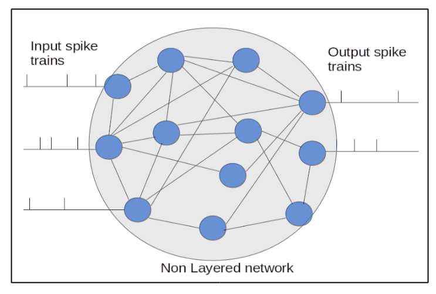

.. _Users-Topology:

Topology
========

In terms of the topology, we are looking into an architecture of the network and interconnections among neurons. The architecture of the simulated neuronal network can be divided as layered and non layered. Layered networks that can be implemented with this platform is a feedforward network. No recurrency is possible at the moment for a layered network. Different neuron models can be implemented for each layer, for eg. input layer can be of Leaky Integrate and Fire neuons and layer 2 can be Izhikevich or any combination of the available neuron models.

Within layered and non-layered networks, how the neurons are connected can also be altered. Manual connection is not a suitable choice since it is labourous and takes very long time to configure one by one. Hence, three differnt options for automatic interconnections are presented. Please see :ref:`interconnections_lable` for more details about the options.

Architecture
------------
The first step of the network creation is specifying whether to create a layered or non layered network. 

.. figure:: ../images/layernolayer.png

	Figure: First step of network creation

Layered
~~~~~~~

The figure below shows a typical graphical representation of what a layered network is. The first layer in the layered network is the input layer where stimulus are applied and the last layer is the readout layer. The interconnections among neurons between the layers is described in :ref:`interconnections_lable`. 

.. figure:: ../images/topology_layered.png

  Figure:  Graphical illustration of the layered network

Number of layers need to be specified. Neuron are numbered in an increasing order from the first layer to the last. 
The menu guides to select number of neurons in each layer along with neuron models for each layer if different neuron model option is selected. 

	Figure: Menu to choose number of layers

.. figure:: ../images/no_of_neurons.png

	Figure: selection of number of neurons	

Non-layered
~~~~~~~~~~~

In contrast to layered network, non layered network has no apparent layered structured. Any two neurons can be connected to each other. The user has full control over which neurons can be assigned as input neurons and output neurons. The topology can be illustrated as shown in the figure below. 

  Figure:  Graphical illustration of the non-layered network 

.. _interconnections_lable:

Interconnections
----------------

Fully interconnected network
~~~~~~~~~~~~~~~~~~~~~~~~~~~~

Randomly connected network
~~~~~~~~~~~~~~~~~~~~~~~~~~

Probabilistic network
~~~~~~~~~~~~~~~~~~~~~

