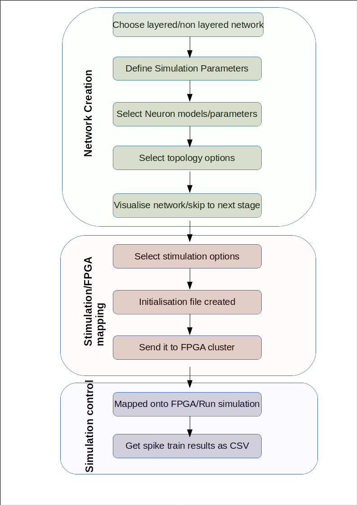

.. _Users-index:

User Manual 
===========
This part of the documentation is focused to provide a comprehensive details of the interface for users to make it easier to understand capabilities and limitations for the desired simulation. This section covers all the components of the interface and how they all come together during network creation with different possibilities for different types of neuron models, network type, stimulation and capabilities to control how the simulation runs. 

All the configuration are rather simple with just drop down buttons without any need of programming proficiency. We will cover different aspects of the interface followed with an exemplary tutorials on how to use the platform. 

.. toctree::
  :maxdepth: 4

  UserAccount
  SimulationParameters
  NeuronModel
  Topology
  Stimulation
  Results 
  ExamplesTutorials

The whole process is simplied as a flow of events in a sequential order. 

