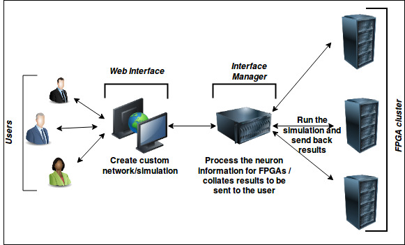

FPGA Web Interface: Introduction
===================================

The Field Programmable Gate-Arrays(FPGAs) clusters offers a powerful hardware platform capable of performing realistic simulations of Biological Neural Systems(BNS). However, making use of such powerful platform is not easy and not all users have enough understanding and experience to exploit such hardware. Having a user friendly software platform to interact with FPGAs in a much higher abstraction level will allow more researchers to make use of such powerful hardware without having to spend a lot of time actually understanding the platform. Such user interface takes away a certain level of abstraction and makes it intuitive and easy to generate desired biologically inspired neural network with desired neuron models, synpase models, network size, network topology and desired stimulation configuration for the neural network. Here, we discuss web based user interface that we developed to interface with the FPGA cluster that allows users to easily and intuitively create desired network to be run on the FPGA cluster. 

.. note:: So far only biologically inspired spiking neuron models are implemented.  

The web interface is linked to the interface manager (IM) which works as an intermediate node between web interface and the FPGA clusters and manages flow of packets to and from both FPGAs and web interface.IM receives the simulation initialisation files from the web interface generated by the users which will be sent to the appropriate FPGA nodes for simulatio and result packets received from the FPGA clusters once the simulation has completed are sent back to the web interface. It can shown as :

	
	Figure1: Simplified work flow of the whole process

Some of the features of the web interface are listed below:

* Select existing parameterisable neuron models from the model library. 
* Specify number of neurons with same or different neuron models.
* Select layered or non-layered network. Layered network would be a feedforward network where the first layer is the input layer and last layer is the output.
* Select same or different neruon models on each layer. All the neurons in a single layer will have the same neuron model. 
* Select the type of topology; fully interconnected, random or probabilistic(30% connection at the moment)
* Configure the simulation paramters such as simualtion time, timestep size, watchdog period etc. 
* Specify stimulation parameters such as start and end time and voltage. [*Only step stimulation is implemented at the moment*]
* Visualisation of the spike train obtained after the simulation as raster plot. 

.. toctree::
	:maxdepth: 2
	:caption: Contents

	Getting started
	Help	

     

Indices and tables
==================

* :ref:`genindex`
* :ref:`modindex`
* :ref:`search`

testing
